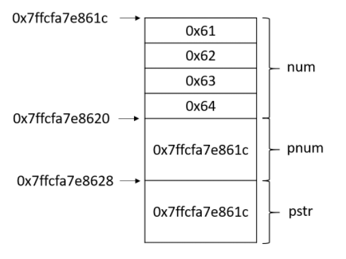

## reinterpret_cast
可以用于任意类型的指针之间的转换，对转换的结果不做任何保证
## dynamic_cast
这种其实也是不被推荐使用的，更多使用static_cast，dynamic本身只能用于存在虚函数的父子关系的强制类型转换，对于指针，转换失败则返回nullptr，对于引用，转换失败会抛出异常
## const_cast
对于未定义const版本的成员函数，我们通常需要使用const_cast来去除const引用对象的const，完成函数调用。另外一种使用方式，结合static_cast，可以在非const版本的成员函数内添加const，调用完const版本的成员函数后，再使用const_cast去除const限定。
## static_cast
完成基础数据类型；同一个继承体系中类型的转换；任意类型与空指针类型void* 之间的转换。

1、const_cast
用于将const变量转为非const
2、static_cast
用于各种隐式转换，比如非const转const，void*转指针等, static_cast能用于多态向上转化，如果向下转能成功但是不安全，结果未知；
3、dynamic_cast
用于动态类型转换。只能用于含有虚函数的类，用于类层次间的向上和向下转化。只能转指针或引用。向下转化时，如果是非法的对于指针返回NULL，对于引用抛异常。要深入了解内部转换的原理。
向上转换：指的是子类向基类的转换
向下转换：指的是基类向子类的转换
它通过判断在执行到该语句的时候变量的运行时类型和要转换的类型是否相同来判断是否能够进行向下转换。
4、reinterpret_cast C++类型转换之reinterpret_cast - 知乎 (zhihu.com)
几乎什么都可以转，比如将int转指针，可能会出问题，尽量少用；
“reinterpret_cast 运算符并不会改变括号中运算对象的值，而是对该对象从位模式上进行重新解释
指针类型会教导编译器如何解释某个特定地址中的内存内容及其大小。

```CPP
#include <iostream>
using namespace std;
int main(int argc, char** argv)
{
	int num = 0x00636261;//用16进制表示32位int，0x61是字符'a'的ASCII码
	int * pnum = &num;
	char * pstr = reinterpret_cast<char *>(pnum);
	cout<<"pnum指针的值: "<<pnum<<endl;
     // 指针地址
	cout<<"pstr指针的值: "<<static_cast<void *>(pstr)<<endl;//直接输出pstr会输出其指向的字符串，这里的类型转换是为了保证输出pstr的值
    // 指针地址，与pnum相同	
 cout<<"pnum指向的内容: "<<hex<<*pnum<<endl;
     //0x00636261
	cout<<"pstr指向的内容: "<<pstr<<endl;
     // abc 
     // 这是由于在输出char*指针时，输出流会把它当做输出一个字符串来处理，直至遇到’\0’才表示字符串结束
	return 0;
}
```

